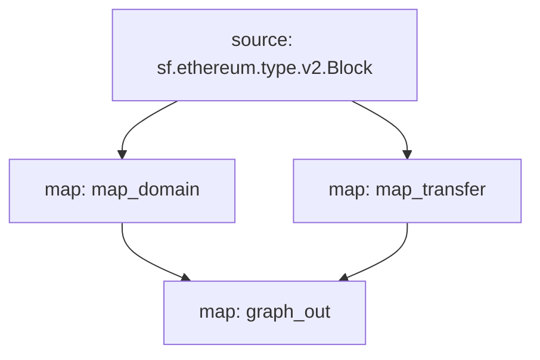

# ENS Substream Powered Subgraph

This substream is a start at building out an ENS SPS, based on the current version of the [ENS Subgraph](https://thegraph.com/hosted-service/subgraph/ensdomains/ens).

## Quickstart

### 1. Install Dependencies & Authentication

Make sure you have the latest versions of the following installed:

- [Rust](https://rustup.rs/)
- [Make](https://formulae.brew.sh/formula/make)
- [graph-cli](https://thegraph.com/docs/en/cookbook/quick-start/#2-install-the-graph-cli)
- [substreams-cli](https://substreams.streamingfast.io/getting-started/installing-the-cli)


Follow the authentication instructions [here](https://substreams.streamingfast.io/getting-started/quickstart).

Ensure that `substreams` CLI works as expected:

```
substreams -v
substreams version 1.1.9 (Commit 7ff8bd0, Built 2023-07-24T17:05:07Z)
```

> **Note** Your version may differ.

### 2. Compile the Project with `make build`

We now need to recompile our WASM binary with the new changes we made to the rust files.

### 3. Pack the spkg with `make pack`

We need to bundle the protobuf definitions and the WASM binary into a single file. This is what we will deploy the subgraph.

### 4. Deploy the subgraph with `graph deploy <SUBGRAPH>`

Tweak the subgraph parameter for your setup.

### 7. Schema

Schema is based upon the ENS subgraph schema. It should follow this exactly a Subgraph to SPS migration will not cause any issues.

```graphql
type Domain @entity {
  id: ID!
  name: String
  labelName: String
  labelhash: Bytes
}

type NameTransferred @entity {
  id: ID!
  tokenId: String!
  blockNumber: BigInt!
  transactionID: Bytes!
  owner: String!
}
```

### 8. Data Flow


